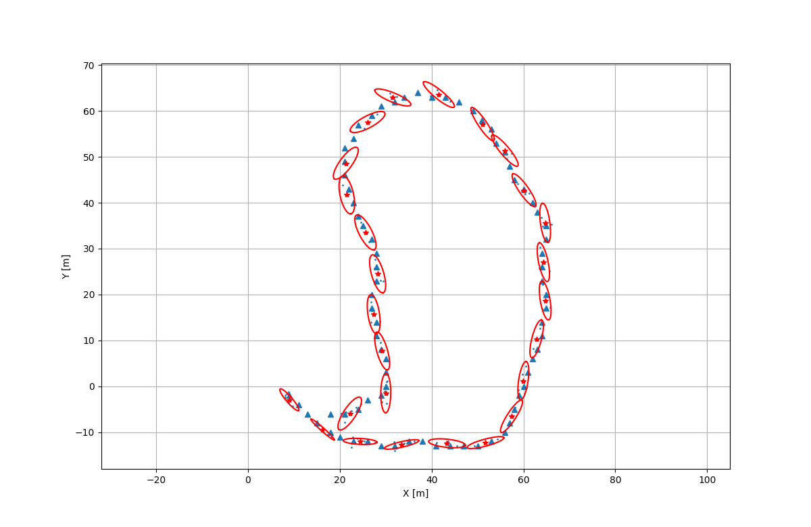
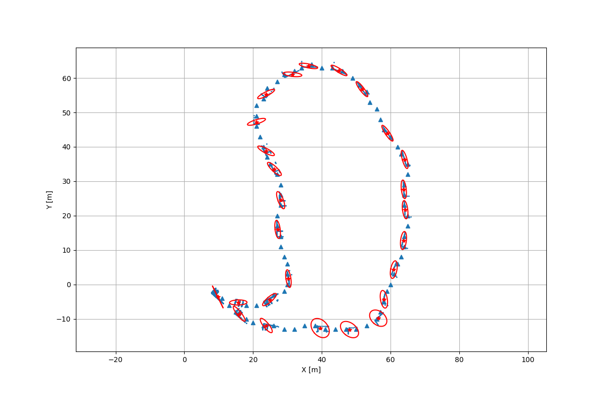

# MEM EKF*
C++ implementation of MEM-EKF tracker

Implementation based on article: "Tracking the Orientation and Axes Lengths of an Elliptical Extended Object", Shishan Yang, Marcus Baum (https://arxiv.org/abs/1805.03276).

## Examples
### Radar

### Lidar
